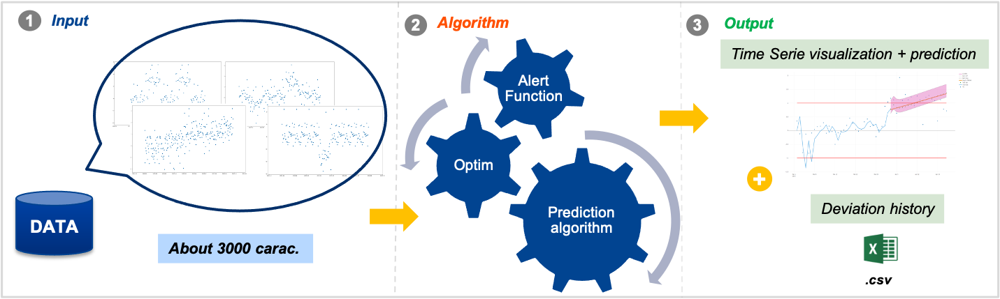
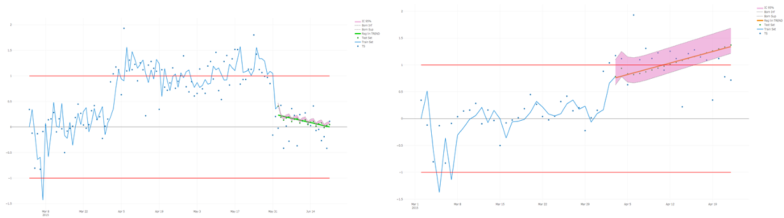

# TS_study
During internship, try to study time series forecasting by using benchmark of algorithms

 

## Project
The purpose of this project is to realize a benchmark of forecasting algorithms on time series.
Analysis with PACF, ACF, using Dicker-Fuller test, AR, AM, SARIMA models, try Lasso & Ridge (regularization regression) etc ...
It's used for a drift detection algorithm when I was intern ar SAFRAN, the data are created based on pseudo distribution, no privacy data.

This is an example of forecasting TS :

 
